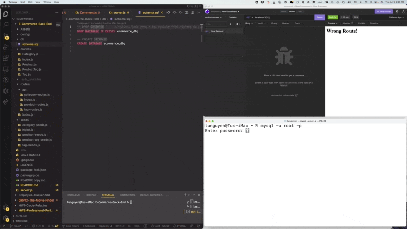

# E-Commerce-Back-End
Repo: https://github.com/vi3t4lov3/E-Commerce-Back-End
## Description
Developers build the back end for an e-commerce site by modifying starter code. You’ll configure a working Express.js API to use Sequelize to interact with a MySQL database.

## Table of Contents

- [E-Commerce-Back-End](#e-commerce-back-end)
  - [Description](#description)
  - [Table of Contents](#table-of-contents)
  - [Dependencies](#dependencies)
  - [Installation](#installation)
  - [Usage](#usage)
  - [Contribute](#contribute)
  - [Tests](#tests)
  - [Demo](#demo)
  - [Questions](#questions)
  - [License](#license)

## Dependencies

- HTML
- CSS
- Javascript (OOP, Node.js, ExpressJS, MySQL)

## Installation

You can run a local copy of this site by issuing the following commands.

```bash
$ git clone https://github.com/vi3t4lov3/E-Commerce-Back-End.git
$ cd E-Commerce-Back-End
$ Dont forget to run SOURCE schema.sql & seeds.sql in db folder
$ run npm init 
$ npm node .
```

## Usage

```md
GIVEN a functional Express.js API
WHEN I add my database name, MySQL username, and MySQL password to an environment variable file
THEN I am able to connect to a database using Sequelize
WHEN I enter schema and seed commands
THEN a development database is created and is seeded with test data
WHEN I enter the command to invoke the application
THEN my server is started and the Sequelize models are synced to the MySQL database
WHEN I open API GET routes in Insomnia for categories, products, or tags
THEN the data for each of these routes is displayed in a formatted JSON
WHEN I test API POST, PUT, and DELETE routes in Insomnia
THEN I am able to successfully create, update, and delete data in my database 
```

## Contribute

1. Fork it
2. Create your feature branch (`git checkout -b my-new-feature`)
3. Commit your changes (`git commit -am 'Add some feature'`)
4. Push to the branch (`git push origin my-new-feature`)
5. Create new Pull Request

## Tests

```
NO TEST THIS TIME
```

## Demo


[Click here] (https://www.youtube.com/watch?v=929Bt5nxw5s) 

## Questions

If you have questions about this repository reach me by Github: [vi3t4lov3](https://github.com/vi3t4lov3)
or send an email: tuinfor@ymail.com

## License

[](https://opensource.org/licenses/MIT)

